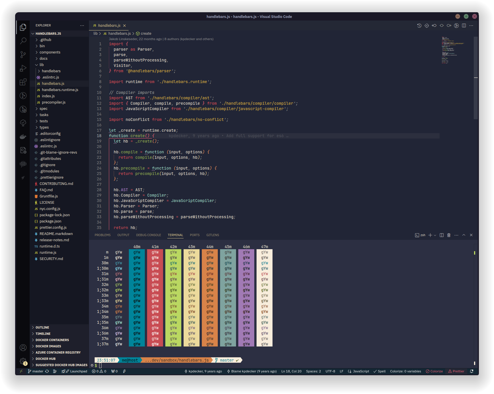

<h1 align="center">
	
    <br/>
	Emberstone for VS Code
</h1>

<div align="center">

[](#license "License")


</div>

A vibrant, dark theme with warm accents to boost focus. Designed for those seeking a solid, lively environment that’s easy on the eyes.

## Preview

<div align="center">
	
</div>

## Install theme

### From marketplace

This theme is not yet published on Microsoft Marketplace.

It is planned to be released soon.

### From sources

To install the theme from a `.vsix` file located at the root of your project (e.g., `emberstone-x.x.x.vsix`), follow these steps:

1. **Open Visual Studio Code.**

2. **Access the Extensions View** by clicking on the Extensions icon in the Activity Bar on the side of the window, or by pressing `Ctrl+Shift+X`.

3. **Install from VSIX**:
   - Click on the three dots (`...`) in the top-right corner of the Extensions view.
   - Select **"Install from VSIX..."** from the dropdown menu.
   - In the file dialog that opens, navigate to the root of your project and select the `emberstone-x.x.x.vsix` file.

4. **Activate the Theme**:
   - After installation, activate the theme by opening the Command Palette (`Ctrl+Shift+P`), typing "Color Theme," and selecting `Emberstone` from the list.

This method allows you to install the theme directly from your local development environment without needing to publish it to the marketplace first.

## Building theme

First, ensure you have the tools to publish/build VSCode extensions:

```bash
npm install -g @vscode/vsce
```

To recreate the `.vsix` file, use this command:

```bash
vsce package
```

This will generate a `.vsix` file that you can [install from Visual Studio Code](https://code.visualstudio.com/docs/editor/extension-gallery#_install-from-a-vsix) following the instructions provided above.

## 💬 Contributing

We welcome contributions! Whether it's reporting a bug, requesting a new feature, or directly improving the themes, your input helps shape Emberstone.

## 📢 Feedback & Support

Found a bug? Have a feature request? Head over to the project issue page to let us know.

## 📜 License

Emberstone is open-source and available under the MIT License.
